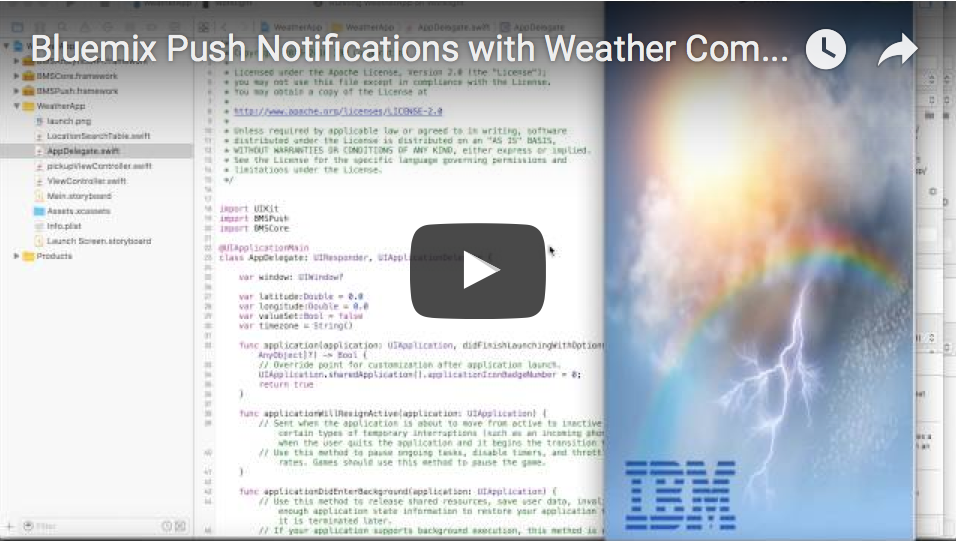

Weather Push Notifications
===========================================

Weather push sample is an example usage of [Bluemix Push Notifications Service](https://console.ng.bluemix.net/docs/services/mobilepush/index.html?pos=2) with the help of [Weather Company Data Service](https://console.eu-gb.bluemix.net/docs/services/Weather/index.html) , [OpenWhisk](https://developer.ibm.com/open/openwhisk/) and [Cloudant Service](https://cloudant.com/). 


[](https://youtu.be/dsEn82yn70o)


## Overview

The Weather Push Notification sample implements the core features of the scenario described above. It showcases OpenWhisk, Weather Company Data APIs, and Cloudant with Bluemix Push Notifications service and demonstrates mobile integration capabilities. The location details will be stored in the cloudant `weather` database. The OpenWhisk will read the location details from the `weather` database everyday at purticular time(cron job) and will send data to `Weather Company Data APIs`. The Weather Company Data Service will send back the results to OpenWhisk. By analyzing the results, OpenWhisk will create appropriate weather message. This message gets pushed to `IBM Push Notifications service`, and is delivered to the mobile device.


## Requirements

### Setup Bluemix and Cloudant.

Complete the steps:

1. Create a [Bluemix Application](http://console.ng.bluemix.net). Configure the Bluemix Push Notifications service.

2. Create and bind a Weather Company Data Service to your application.

3. Create a database named `weather` in your [Cloudant](https://cloudant.com/). In the `weather` database, create a view named `new_view` and design named `weather`.

4. Click the new design document you have created in step 3 and update it with the following lines. Do not have to change the `_id` and `_rev` values.

	```
	{
    "_id": "_design/weather",
    "_rev": "11-4d9b81ad9fa319a4a1d3b213ff233eda",
	"indexes": {
	    "fields": {
	        "analyzer": "keyword",
	        "index": "function(doc) {index(\"default\", doc._id, {\"facet\": true});if ((doc.latitude) || (doc.latitude===0)){index(\"doc.latitude\", doc.latitude);}if ((doc.longitude) || (doc.longitude===0)){index(\"longitude\", doc.longitude);}if ((doc.timezone) || (doc.timezone===0)){index(\"timezone\", doc.timezone);}if ((doc.deviceIds) || (doc.deviceIds===0)){index(\"deviceIds\", doc.deviceIds);}}"
	    }
	},
	"views": {
	    "new_view": {
	       "map": "function (doc) {emit(doc._id,[doc.latitude,doc.longitude,doc.timezone,doc.deviceIds]);}"
	    }
	},
	"language": "javascript"
	}

	```
	


## Sending Push Notifications

The `weatherAlert.js` file need the following parameters to complete the actions. 

- `appId` - Bluemix app GUID.

- `appSecret` - Bluemix Push Notification service appSecret.

- `apiKey` - This is the username:password combination Weather Company Data Service.

- `cloudantUserName` - Your Cloudant username. This is for accessing your `weather` database in Cloudant.

- `cloudantPassword` - Your Cloudant password. This is for accessing your `weather` database in Cloudant.

- `appRegion` - Region where your Bluemix app is hosted. For example,for US Dallas -`.ng.bluemix.net`.


### Setup the OpenWhisk.

For OpenWhisk setup, you need to get authentication from [Bluemix OpenWhisk](https://new-console.ng.bluemix.net/openwhisk/cli). Install OpenWhisk CLI and Authentication.

### Example App.

The example app have Feedback sending feature. Complete the following steps before running the example app:


1. Create an OpenWhisk `action` using the command:

	``` 
	wsk action update  yourActionName weatherAlert.js -p cloudantUserName 'your_Cloudant_UserName' -p cloudantPassword 'your_Cloudant_Password' -p appSecret 'push_Service_AppSecret' -p appId 'bluemix_appId' -p appRegion 'region_app_Hosted' 
	```

2. Create a OpenWhisk `Trigger` with `/whisk.system/alarms/alarm` as a feed.

	```
	wsk trigger create yourTriggerName --feed /whisk.system/alarms/alarm --param cron '* * 6 * * *'
	```
 When specifying your cron values you'll need to make sure that your values fall within the ranges.

	    * Seconds: 0-59
	    * Minutes: 0-59
	    * Hours: 0-23
	    * Day of Month: 1-31
	    * Months: 0-11
	    * Day of Week: 0-6

3. Create OpenWhisk rule to join `yourActionName` and `yourTriggerName`.

	```
	wsk rule create --enable yourRule yourTriggerName yourActionName
	```
4. Enable the activation poll.

	```
	wsk activation poll
	```
5. Open the example app in `XCode.app`. Go to the `Info.plist` file and add values for `cloudantPermission` and `cloudantUserName`. 

 

6. Do `carthage update` in the application to add the [Bluemix Push service SDK](https://github.com/ibm-bluemix-mobile-services/bms-clientsdk-swift-push).

7. Run the application and register for Push Notifications and click on the button `Get Location`.

8. Search in search tab for the location which you want to get weather updates and select the location from search results .

9. Click on the `Bluemix` icon in the pinned location.

 

10. You will get push notifications with weather details of the selected area everyday 6 AM.

 >***Note*** you can change this time by changing the cron value in the trigger

### License

Copyright 2015-2016 IBM Corporation

Licensed under the [Apache License, Version 2.0 (the "License")](http://www.apache.org/licenses/LICENSE-2.0.html).

Unless required by applicable law or agreed to in writing, software distributed under the license is distributed on an "as is" basis, without warranties or conditions of any kind, either express or implied. See the license for the specific language governing permissions and limitations under the license.